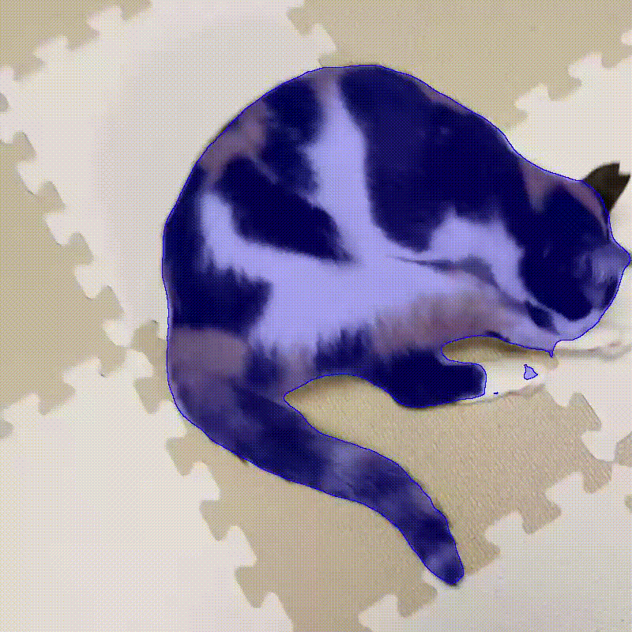
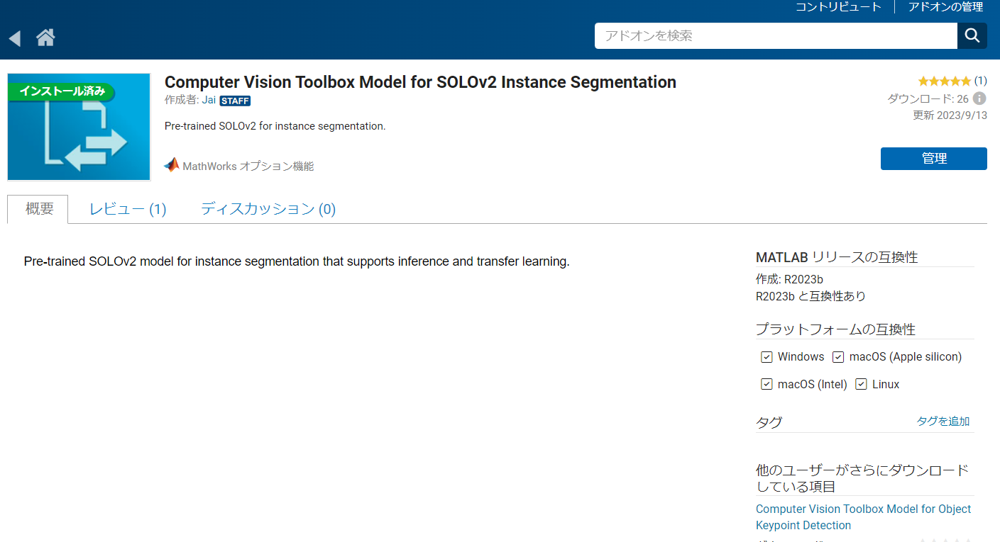
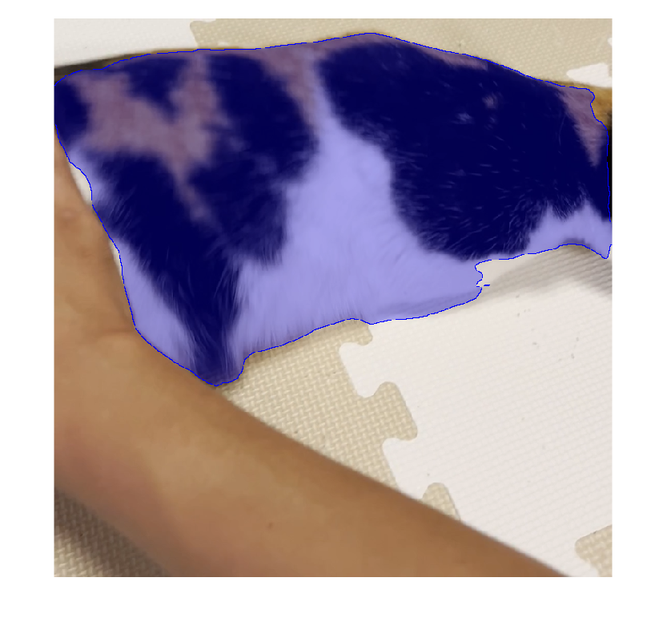

# <span style="color:rgb(213,80,0)">SOLOv2を利用した猫のセグメンテーション</span>

この記事はMATLAB/Simulink Advent Calendar 2023の2日目の記事として書かれています。


[https://qiita.com/advent-calendar/2023/matlab](https://qiita.com/advent-calendar/2023/matlab)

# SOLOv2とは

画像中の物体ごとに色塗り（インスタンスセグメンテーション）をするネットワークです。インスタンスセグメンテーションの有名な方法として、この他にMask R-CNNなどが知られています。


SOLOについては以下の記事がわかりやすかったです。


[https://qiita.com/Kmat67916008/items/474da9f1f5553579cf76](https://qiita.com/Kmat67916008/items/474da9f1f5553579cf76)


MATLABではSOLOv2モデルを非常に簡単に動かすことができます。


本記事ではSOLOv2を利用して以下のようなセグメンテーション結果を得る方法ついて説明します。また利用したコードや動画は以下のページに格納しています。

<p style="text-align:left"></p>

# MATLABでSOLOv2を実行する
## 前準備：アドオンのインストール

はじめに、Computer Vision Toolbox Model for SOLOv2 Instance Segmentation をインストールしておく必要があります。

<p style="text-align:left"></p>

## コードの実行

動画に対して、SOLOv2のモデルを実行し、猫の部分を色塗りしてみます。


ポイントは以下の通りです。

-  solov2関数でSOLOv2モデルを読み込む 
-  segmentObjects関数で画像に対してSOLOv2を実行する 
```matlab
clear;clc;close all
% solov2関数でSOLOv2モデルを読み込む
net = solov2("resnet50-coco",InputSize=[800 800 3]);
% 猫の動画を読み込む準備
catVideo = VideoReader("catVideo.mp4");
% 出力結果を保存する準備
v = VideoWriter('segmentationResult.avi','Motion JPEG AVI');
v.FrameRate = 10;

open(v)
% 猫を塗る色の指定
maskColors = "blue";
% ビデオから1フレームずつ読み取り、SOLOv2を実行
while hasFrame(catVideo)
    % フレームの読み込み
    frame = readFrame(catVideo);
    % フレームのリサイズ
    frame = imresize(frame,[800 800]);
    % SOLOv2の実行
    [masks,labels,scores] = segmentObjects(net,frame,Threshold=0.2);
    % 猫のマスクの取り出し
    catMask = masks(:,:,labels=="cat");
    % 猫のエリアの可視化
    overlayedMasks = insertObjectMask(frame,catMask,MaskColor=maskColors,Opacity=0.3);
    % 画像の表示
    imshow(overlayedMasks);
    % 動画への書き込み
    writeVideo(v,overlayedMasks)
end
```

<center></center>


```matlab
close(v)

```
